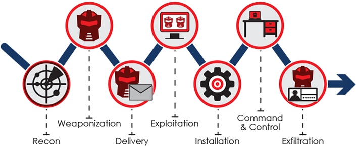

# Ejercicio CiberKillChain - Ataque

## Alumno

Martin Brocca

## Enunciado

Armar una cyberkillchain usando técnicas de la matriz de Att&ck para un escenario relacionado a tu trabajo práctico

## Datos trabajo práctico

#### [Propuesta de trabajo final](https://docs.google.com/document/d/1sbXMk3ynrQVnPDheI14GM2cibfvLnz5RpoOarvGw55Y/edit?usp=share_link)  
#### [Plan de trabajo](https://drive.google.com/file/d/19m_MMk9k9c2oOyLUuq17myVeACkiVvn_/view?usp=share_link)  

### Descripción del proyecto:

Implementacion de sensores y actuadores para control de invernadero:

El propósito de este proyecto es la construcción de un prototipo que incluya los siguientes elementos:
    - Sensores de humedad de suelo
    - Sensores de temperatura y humedad
    - Sistema de control de riego (bomba y válvulas)
    - Sistema de control de temperatura ambiente
    - Una aplicación open-source que controle en base a los valores obtenidos por los sensores, el riego y la temperatura del invernadero.   
  
  

Para el desarrollo del proyecto, los sensores y actuadores fueron desarrollados in-house, mediante el uso de dispositivos ESP32, ESP82866 y sensores capacitivos para humedad de suelo, y sensores DHT22 para temperatura y humedad.
Para la aplicación, se decidió el uso de [ThingsBoard]https://thingsboard.io/ commuinity edition. 

## Resolución
