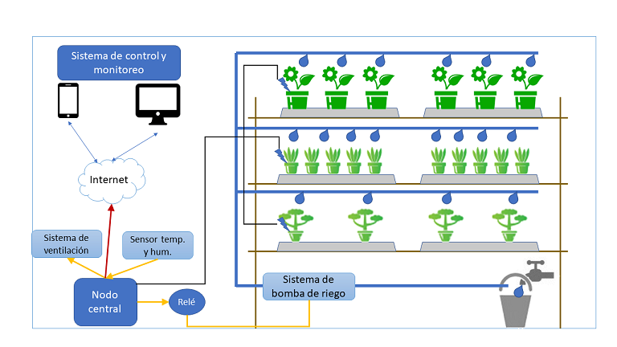

# Ejercicio CiberKillChain - Ataque

## Alumno

Martin Brocca

## Enunciado

Armar una cyberkillchain usando técnicas de la matriz de Att&ck para un escenario relacionado a tu trabajo práctico

## Datos trabajo práctico

#### [Propuesta de trabajo final](https://docs.google.com/document/d/1sbXMk3ynrQVnPDheI14GM2cibfvLnz5RpoOarvGw55Y/edit?usp=share_link)  
#### [Plan de trabajo](https://drive.google.com/file/d/19m_MMk9k9c2oOyLUuq17myVeACkiVvn_/view?usp=share_link)  

### Descripción del proyecto:

Implementacion de sensores y actuadores para control de invernadero:

El propósito de este proyecto es la construcción de un prototipo que incluya los siguientes elementos:
    - Sensores de humedad de suelo
    - Sensores de temperatura y humedad
    - Sistema de control de riego (bomba y válvulas)
    - Sistema de control de temperatura ambiente
    - Una aplicación open-source que controle en base a los valores obtenidos por los sensores, el riego y la temperatura del invernadero.   
  
  

Para el desarrollo del proyecto, los sensores y actuadores fueron desarrollados in-house, mediante el uso de dispositivos ESP32, ESP82866 y sensores capacitivos para humedad de suelo, y sensores DHT22 para temperatura y humedad.
Para la aplicación, se decidió el uso de [ThingsBoard](https://thingsboard.io/) commuinity edition. 
El fundamento de esta selección, es no entregar una aplicación sin soporte futuro al cliente.  
La instación final del proyecto es en una casa de retiro, ubicada en el estado de Carolina del Norte, Estados Unidos de America. Dicha propiedad cuenta con una superficie de aproximadamente 50 acres, en una zona rural. 
## Resolución

## 1 Reconnaissance:
    La solución implica un perfil reducido de ataque fisico, al estar aislada en una zona de bosques, sin vecinos inmediatos ni infrastructura de conección disponible en las inmediaciones (torres de antenas o postes, baja disponibilidad de internet: solo hay disponiblidad de internet satelital o celular).
    La inspeccion visual del area revela una  Raspberry PI en la zona del invernadero, por ello el sistema operativo inferido sera de la familia de Linux (Raspbian, Ubuntu, etc)
    El cliente presenta un perfil muy bajo de participación en redes sociales. No tiene perfil de Facebook, Twitter, solamente posee una cuenta de poca actividad en LinkedIn.
    El cliente proviene de una empresa con alta cultura de ciberseguridad, por lo que no sera facil engañarlo con tecnicas de Phishing. 
    La propiedad cuenta con un buzón de correspondencia en la entrada, sin vigilancia y a una distancia segura como para poder inspeccionar el contenido en busca de informacion sobre pagos a proveedores de internet, u otros patrones de conducta. 
    Evaluar utilizar herramienetas como IP Scanners o Port Scanners para descubrir la red empleada en la propiedad y los dispositivos conectados

## 2 Weaponization:
    Análisis de la aplicación seleccionada: ThingsBoard en foros de seguridad: https://www.exploit-db.com/ghdb/5831
    Análisis de vulnerabilidades en sistema operativo Raspbian: https://cve.mitre.org/cgi-bin/cvekey.cgi?keyword=raspberry+pi
    Análisis de terreno para identificar potenciales lugares desde donde haya linea de vista con la solución (ruta, caminos secundarios)
    En base a los resultados del exámen del buzón físico, investigar si la conexión a internet es por proveedor directo mediante enlance punto a punto, satelite o celular.
    Creación de un perfil falso en LinkedIn con intereses afines a los encontrados en el correo fisico.
    El escaneo de puertos revela un servidor de HTTP (no seguro), y dispositivos que se conectan a la aplicacion mediante tokens estaticos.
    
## 3 Delivery:
    Envio de una memoria SD por correo fisico con codigo autoejecutable.
    Solicitud de conexión en LinkedIn, envio de mensajes directos con contenidos de interes.
    Uso de herramientas tipo *metasploit* para encontrar vulnerabilidades.

## 4 Exploitation:
    En caso de exito de uso de la memoria SD, o acceso a algun link compartido en LinkedIn:
        Explotar vulnerabilidades del sistema operativo para ganar control o credenciales elevadas
        Explotar vulnerabilidades de la aplicacion (busqueda de APIs abiertas, SQL Injection, o XSS)

## 5 Installation:
    Instalacion de una consola web, un servicio que permita una puerta trasera de acceso al sistema o un sistema que replique contenido descubierto a sitio externo.
    

## 6 Command and Control
    Asegurarse que el sistema infectado permanezca sin ser detectado.

## 7 Actions on Objectives
    Intentar ganar acceso a otros sistemas de la propiedad, como circuitos de camaras o las computadoras de trabajo.
    Proceder a extraer toda la informacion capturada.
    Cambios en la configuración de la aplicación, para perjudicar el fin del proyecto (arruinar cosechas/plantas afectar equipos por encendidos prolongados, etc)

