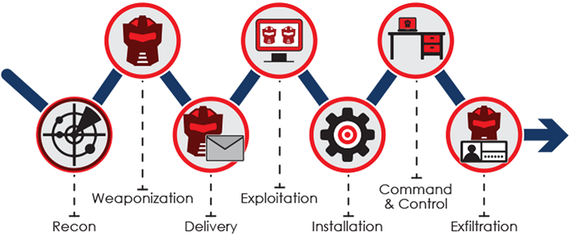
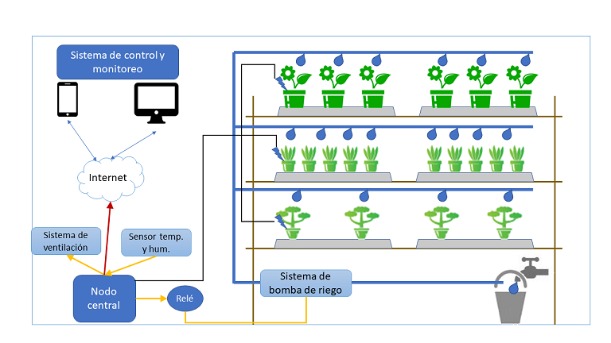

# Ejercicio CiberKillChain - Defensa

## Alumno

Martin Brocca

## Enunciado

Armar una cyberkillchain usando técnicas de la matriz de Att&ck para un escenario relacionado a tu trabajo práctico

## Datos trabajo práctico

### [Propuesta de trabajo final](https://docs.google.com/document/d/1sbXMk3ynrQVnPDheI14GM2cibfvLnz5RpoOarvGw55Y/edit?usp=share_link)  
### [Plan de trabajo](https://drive.google.com/file/d/19m_MMk9k9c2oOyLUuq17myVeACkiVvn_/view?usp=share_link)  

## Descripción del proyecto:

Implementacion de sensores y actuadores para control de invernadero:

El propósito de este proyecto es la construcción de un prototipo que incluya los siguientes elementos:
    - Sensores de humedad de suelo
    - Sensores de temperatura y humedad
    - Sistema de control de riego (bomba y válvulas)
    - Sistema de control de temperatura ambiente
    - Una aplicación open-source que controle en base a los valores obtenidos por los sensores, el riego y la temperatura del invernadero.   
  
  

Para el desarrollo del proyecto, los sensores y actuadores fueron desarrollados in-house, mediante el uso de dispositivos ESP32, ESP82866 y sensores capacitivos para humedad de suelo, y sensores DHT22 para temperatura y humedad.
Para la aplicación, se decidió el uso de [ThingsBoard](https://thingsboard.io/) commuinity edition. 
El fundamento de esta selección, es no entregar una aplicación sin soporte futuro al cliente.  
La instación final del proyecto es en una casa de retiro, ubicada en el estado de Carolina del Norte, Estados Unidos de America. Dicha propiedad cuenta con una superficie de aproximadamente 50 acres, en una zona rural. 
## Resolución

### 1 Reconnaissance:
    La infrastructura del proyecto cuenta con un servidor instalado en una Raspberry PI, corriendo sistema operativo Raspbian, donde corre la aplicacion Thingsboard Community Edition. 
    El proyecto cuenta con un servidor HTTPS mediante un certificado auto-firmado, y los dispositivos se conectan a la aplicacion mediante Tokens configurados de manera estatica en el codigo.
    El acceso desde internet se proveerá mediante apertura en el firewall del proveedor de internet al dispositivo. Para la resolución dináamica de DNS, aún se están evaluando soluciones.

    Si bien es una aplicación basada en Java, las últimas vulnerabilidades críticas no han afectado a la plataforma (ej: Log4J).
    La vlan del sistema sera dedicada.
    Evaluar la capacidad de monitoreo de trafico del router de internet, para detectar conexiones salientes del sistema, o incorporar monitoreo de las interfaces de red de la Raspberry.
 

### 2 Weaponization:
    
    Análisis de la aplicación seleccionada: ThingsBoard en foros de seguridad: https://www.exploit-db.com/ghdb/5831
    Análisis de vulnerabilidades en sistema operativo Raspbian: https://cve.mitre.org/cgi-bin/cvekey.cgi?keyword=raspberry+pi
    Configurar el parcheo y actualizacion del sistema operativon mediante uso de repositorios oficiales.
    Asegurarse de no retrarse en versiones de la aplicacion, y solo aceptar parches del sitio oficial de la aplicacion.
    Si es posible, reducir la potencia de la señal de wifi de forma de minimizar el radio de cobertura del access-point a las zonas de incumbencia del invernadero.
    Asegurarse de configurar usuarios y roles en el sistema operativo y en la aplicacion. Minimizar usuarios con acceso a operaciones privilefiadas (sudo).

### 3 Delivery:
    
    Conforme a lo aprendido y entrenado (durante la vida laboral en una empresa de alta conciencia en seguridad), no abrir correos fisico o electrónico sospechosos. En el caso de abrir un correo electrónico, revisar links y descartar de ser posible.
    No incluir datos personales en las redes sociales que pudieran dar detalles de referencias o ubicacion en publicaciones o perfiles, por ejemplo remover metadata de geolocalización en fotos.
    Analizar incorporar un buzón fijo con llave maestra (buzones que los sistemas de correo pueden abrir con una llave, y el cliente con otra), o una PO Box (equivalente a una casilla de correo).

### 4 Exploitation:
    Relevar frecuentemente el estado y transmisión de las placas de red de la Raspberry PI, sea en conexiones salientes a internet, o simplemente como resultado de comandos como netstat (o ss) para identificación de trafico de destino.
    Revisar estados de backup del sistema.
    Tener un plan de DR Test, en este caso alcanzaría tener un par de copias de la tarjeta SD de la Raspberry con el sistema instalado, y los dispositivos y reglas de automatización ya configurados.
    Revisar periodicamente los puertos abiertos del router/firewall de acceso a internet.

### 5 Installation:
    Alertar y/o bloquear cambios en directorios de instalacion frecuentes.
    Asegurarse de validar hash o firmas de ejecutables.

    

### 6 Command and Control (C2)
    Realizar analisis de código abierto en busca de nuevas amenazas en infraestructura de C2.
    Evaluar el uso de un proxy, con bloqueo por categoria de destino para toda salida a internet del sistema.

    

### 7 Actions on Objectives
- Minizar retrasos en manejos de alertas.# Ejercicio CiberKillChain - Ataque

## Alumno

Martin Brocca

## Enunciado

Armar una cyberkillchain usando técnicas de la matriz de Att&ck para un escenario relacionado a tu trabajo práctico

## Datos trabajo práctico

### [Propuesta de trabajo final](https://docs.google.com/document/d/1sbXMk3ynrQVnPDheI14GM2cibfvLnz5RpoOarvGw55Y/edit?usp=share_link)  
### [Plan de trabajo](https://drive.google.com/file/d/19m_MMk9k9c2oOyLUuq17myVeACkiVvn_/view?usp=share_link)  

## Descripción del proyecto:

Implementacion de sensores y actuadores para control de invernadero:

El propósito de este proyecto es la construcción de un prototipo que incluya los siguientes elementos:
    - Sensores de humedad de suelo
    - Sensores de temperatura y humedad
    - Sistema de control de riego (bomba y válvulas)
    - Sistema de control de temperatura ambiente
    - Una aplicación open-source que controle en base a los valores obtenidos por los sensores, el riego y la temperatura del invernadero.   
  
  

Para el desarrollo del proyecto, los sensores y actuadores fueron desarrollados in-house, mediante el uso de dispositivos ESP32, ESP82866 y sensores capacitivos para humedad de suelo, y sensores DHT22 para temperatura y humedad.
Para la aplicación, se decidió el uso de [ThingsBoard](https://thingsboard.io/) commuinity edition. 
El fundamento de esta selección, es no entregar una aplicación sin soporte futuro al cliente.  
La instación final del proyecto es en una casa de retiro, ubicada en el estado de Carolina del Norte, Estados Unidos de America. Dicha propiedad cuenta con una superficie de aproximadamente 50 acres, en una zona rural. 
## Resolución

## 1 Reconnaissance:
    La infrastructura del proyecto cuenta con un servidor instalado en una Raspberry PI, corriendo sistema operativo Raspbian, donde corre la aplicacion Thingsboard Community Edition. 
    El proyecto cuenta con un servidor HTTPS mediante un certificado auto-firmado, y los dispositivos se conectan a la aplicacion mediante Tokens configurados de manera estatica en el codigo.
    El acceso desde internet se proveerá mediante apertura en el firewall del proveedor de internet al dispositivo. Para la resolución dináamica de DNS, aún se están evaluando soluciones.

    Si bien es una aplicación basada en Java, las últimas vulnerabilidades críticas no han afectado a la plataforma (ej: Log4J).
    La vlan del sistema sera dedicada.
    Evaluar la capacidad de monitoreo de trafico del router de internet, para detectar conexiones salientes del sistema, o incorporar monitoreo de las interfaces de red de la Raspberry.
 

## 2 Weaponization:
    
    Análisis de la aplicación seleccionada: ThingsBoard en foros de seguridad: https://www.exploit-db.com/ghdb/5831
    Análisis de vulnerabilidades en sistema operativo Raspbian: https://cve.mitre.org/cgi-bin/cvekey.cgi?keyword=raspberry+pi
    Configurar el parcheo y actualizacion del sistema operativon mediante uso de repositorios oficiales.
    Asegurarse de no retrarse en versiones de la aplicacion, y solo aceptar parches del sitio oficial de la aplicacion.
    Si es posible, reducir la potencia de la señal de wifi de forma de minimizar el radio de cobertura del access-point a las zonas de incumbencia del invernadero.
    Asegurarse de configurar usuarios y roles en el sistema operativo y en la aplicacion. Minimizar usuarios con acceso a operaciones privilefiadas (sudo).

## 3 Delivery:
    
    Conforme a lo aprendido y entrenado (durante la vida laboral en una empresa de alta conciencia en seguridad), no abrir correos fisico o electrónico sospechosos. En el caso de abrir un correo electrónico, revisar links y descartar de ser posible.
    No incluir datos personales en las redes sociales que pudieran dar detalles de referencias o ubicacion en publicaciones o perfiles, por ejemplo remover metadata de geolocalización en fotos.
    Analizar incorporar un buzón fijo con llave maestra (buzones que los sistemas de correo pueden abrir con una llave, y el cliente con otra), o una PO Box (equivalente a una casilla de correo).

## 4 Exploitation: 
- Relevar frecuentemente el estado y transmisión de las placas de red de la Raspberry PI, sea en conexiones salientes a internet, o simplemente como resultado de comandos como netstat (o ss) para identificación de trafico de destino.
- Revisar estados de backup del sistema.
- Tener un plan de DR Test, en este caso alcanzaría tener un par de copias de la tarjeta SD de la Raspberry con el sistema instalado, y los dispositivos y reglas de automatización ya configurados.
- Revisar periodicamente los puertos abiertos del router/firewall de acceso a internet.

## 5 Installation: 
- Alertar y/o bloquear cambios en directorios de instalacion frecuentes.
- Asegurarse de validar hash o firmas de ejecutables.

    

## 6 Command and Control (C2) 
- Realizar analisis de código abierto en busca de nuevas amenazas en infraestructura de C2. 
- Evaluar el uso de un proxy, con bloqueo por categoria de destino para toda salida a internet del sistema. 

    

## 7 Actions on Objectives
    Minizar retrasos en manejos de alertas. 
    Llevar a cabo una evaluación de daños con expertos.  
    Evaluar instalar un capturador de trafico, para posibilitar el replay de actividades. 

- Llevar a cabo una evaluación de daños con expertos. 
- Evaluar instalar un capturador de trafico, para posibilitar el replay de actividades.

